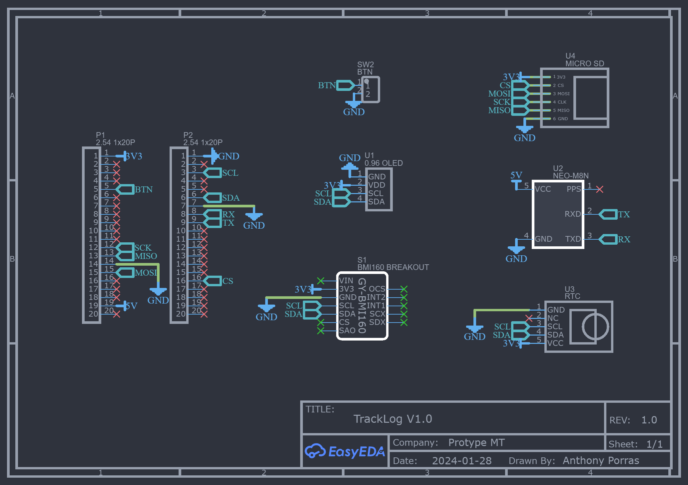
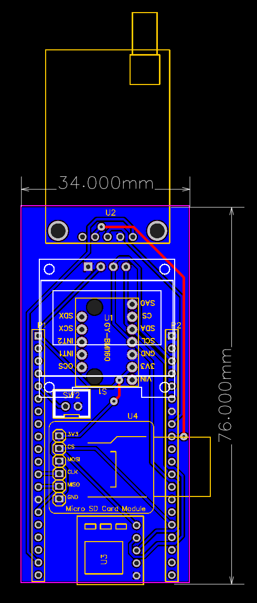

# TrackLog
- Placa de pruebas: [LILYGO-T18](https://github.com/LilyGO/LILYGO-T-Energy)
- GPS Neo 8MN
- Pantalla OLED 0.96''
- Acelerómetro y giroscopio BMI160
- RTC DS3231
- Módulo micro SD card

## Pines Utilizados

En esta sección se detallan los pines utilizados en el proyecto para los diferentes periféricos conectados al microcontrolador.

| Componente              | Pin de Microcontrolador | Función                          |
|-------------------------|-------------------------|----------------------------------|
| **Pantalla OLED (SSD1306)** | I2C SDA (GPIO 21)        | Comunicación I2C (SDA)           |
|                         | I2C SCL (GPIO 22)        | Comunicación I2C (SCL)           |
| **GPS (UART)**           | RX1 (GPIO 19)            | Recepción de datos (RX)          |
|                         | TX1 (GPIO 18)            | Transmisión de datos (TX)        |
| **Tarjeta SD**           | CS (GPIO 15)             | Chip Select (CS)                 |
|                         | MOSI (GPIO 13)           | Master Out Slave In (MOSI)       |
|                         | MISO (GPIO 12)           | Master In Slave Out (MISO)       |
|                         | SCK (GPIO 14)            | Serial Clock (SCK)               |
| **Acelerómetro/Giroscopio (BMI160)** | I2C SDA (GPIO 21)        | Comunicación I2C (SDA)           |
|                         | I2C SCL (GPIO 22)        | Comunicación I2C (SCL)           |
| **RTC (DS3231)**         | I2C SDA (GPIO 21)        | Comunicación I2C (SDA)           |
|                         | I2C SCL (GPIO 22)        | Comunicación I2C (SCL)           |

### Notas adicionales:

- **I2C:** Varios componentes (OLED, acelerómetro/giroscopio, RTC) comparten el bus I2C. Asegúrate de que cada dispositivo tenga una dirección I2C única.
- **SPI:** La tarjeta SD se comunica a través del bus SPI. El pin CS (Chip Select) se define en el código, y el resto de los pines de SPI son comunes a todos los dispositivos SPI.
- **GPS (UART):** El GPS utiliza UART para la comunicación. En este caso, se ha configurado para utilizar UART1.

## PCB TrackLog Shield

Este proyecto incluye el diseño de un **PCB Shield** que se conecta directamente encima de la placa de pruebas [LILYGO-T18](https://github.com/LilyGO/LILYGO-T-Energy). El Shield está diseñado para expandir las capacidades de la placa base, facilitando la conexión de sensores y otros componentes necesarios para el desarrollo del sistema embebido.

### Características del PCB

- **Compatibilidad**: Diseñado específicamente para la placa [LILYGO-T18](https://github.com/LilyGO/LILYGO-T-Energy).
- **Conexiones adicionales**: El Shield incluye pines accesibles para facilitar la conexión de módulos y sensores adicionales.
- **Tamaño compacto**: Encaja directamente sobre la placa LILYGO-T18 sin necesidad de adaptadores adicionales.
- **Facilidad de ensamblaje**: Diseño optimizado para una rápida producción y ensamblaje.

### Esquema del PCB

A continuación se presenta el esquema del diseño del PCB. Este esquema detalla las conexiones entre la placa LILYGO-T18 y los componentes adicionales del Shield.

### Layout del PCB

En el diseño de la PCB se utilizó un ancho de pista de 0.5mm y un espaciado de 0.25mm.

### Archivos Gerber y BOM

Puedes descargar los archivos Gerber para la fabricación del Shield desde el siguiente enlace:

- [Archivos Gerber](PCB/Gerber_PCB_TrackLog_shield_2024-09-17.zip)

### Instrucciones de Montaje

1. **Fabricación**: Utiliza los archivos Gerber para fabricar el PCB.
2. **Componentes**: Sigue la lista de materiales para obtener los componentes necesarios.
3. **Soldadura**: Ensambla los componentes siguiendo el esquema proporcionado.
4. **Montaje en LILYGO-T18**: Coloca el Shield directamente encima de la placa LILYGO-T18, alineando los pines correctamente.

### Vista del PCB ensamblado

Aquí puedes ver cómo luce el PCB Shield una vez ensamblado y conectado a la placa LILYGO-T18:

